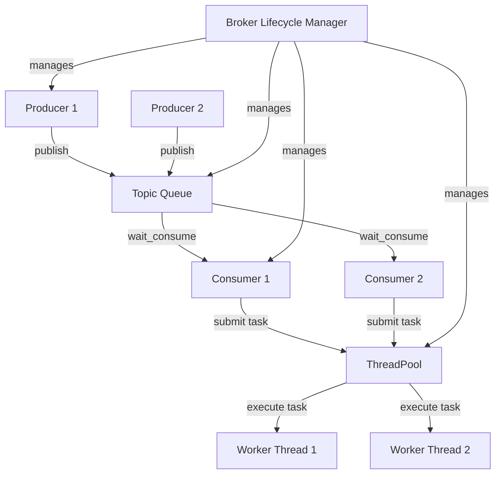

# Mini Kafka

An in-memory, high-throughput, multi-threaded message broker modeled after Apache Kafka, written in C++17. Designed to demonstrate production-grade concurrency architectures, thread-safe asynchronous dispatching, and deterministic resource lifecycle management.

---

## Key Features
*   **Bounded Concurrent Queue**: Implements the Producer-Consumer pattern with dual-condition variables (`condition_not_empty_` and `condition_not_full_`). Blocks producers when the queue reaches capacity to provide memory safety and backpressure.
*   **Thread Pool Engine**: Offloads consumer task execution to a pool of background workers using `std::packaged_task` and `std::future`. Decouples message fetching from message processing.
*   **Graceful Shutdown Sequence**: Guarantees orderly resource cleanup (Producers &rarr; Topic close &rarr; Consumers &rarr; ThreadPool &rarr; Health Monitor &rarr; Logger) to prevent deadlocks and segmentation faults.
*   **Thread-Safe Log Aggregator**: Protects output streams from text interleaving using an asynchronous background logger queue (Actor pattern).
*   **Containerized Environment**: Includes full Dockerfile and Docker Compose support for isolated builds and benchmarking.

---

## High-Level Architecture (HLD)

### System Flow Diagram
```
+---------------------------------------------------------------------------------------------------+
|                                        BROKER (Lifecycle Manager)                                 |
+---------------------------------------------------------------------------------------------------+
                               |                     |                     |
      +------------------------+                     |                     +------------------------+
      |                                              |                                              |
      v                                              v                                              v
+------------+  (Publish Message)  +-----------------------------------+  (wait_consume)  +------------+
|  Producer  |-------------------->|    Topic (Bounded Concurrent Q)   |<-----------------|  Consumer  |
+------------+                     +-----------------------------------+                  +------------+
                                                                                                |
                                                                                                | (Submit Task)
                                                                                                v
                                                                                   +------------------------+
                                                                                   |      ThreadPool        |
                                                                                   +------------------------+
                                                                                     |                    |
                                                                                     v                    v
                                                                                 +--------+           +--------+
                                                                                 | Worker |           | Worker |
                                                                                 +--------+           +--------+
```

### Flow Chart (Mermaid Rendered on GitHub)


---

## Installation & Compilation

### Prerequisites
*   **C++ Compiler**: C++17 compliant compiler (GCC 9+, Clang 10+, or MSVC 2019+)
*   **Build System**: CMake 3.15+

### Build Steps
Clone the project, then configure and build using CMake:
```bash
# Configure the build directory
cmake -B build -DCMAKE_BUILD_TYPE=Release

# Build all targets (App, Tests, and Benchmarks)
cmake --build build --config Release
```

---

## Running the Application
To launch the main simulated broker application:
```bash
# On Windows
.\build\Debug\mini_kafka_app.exe

# On Linux / macOS
./build/mini_kafka_app
```

---

## Docker Setup

You can build and run both the broker and the benchmark inside containerized environments without installing C++ compilers locally.

### Build and Run with Docker Compose
To run the main broker application inside a container:
```bash
docker-compose up broker
```

### Run Benchmarks in Docker
To run a custom benchmark run inside a container:
```bash
docker-compose run --rm benchmark [producers] [consumers] [messages_per_producer] [queue_capacity] [pool_size]

# Example: Run with 8 producers, 8 consumers, 10k messages, 5k queue capacity, 8 thread pool size
docker-compose run --rm benchmark 8 8 10000 5000 8
```

---

## Performance Benchmarking

The project contains a performance suite that measures raw concurrent queue throughput versus full broker pipeline execution (with thread pools and logger queues active).

### Running Benchmarks Locally
To execute the automated multi-scenario benchmark python script:
```bash
py -u benchmark/run_benchmarks.py
```

### Benchmark Results
Below are the actual benchmark results measured on an Intel/AMD multicore development machine:

| Scenario Description | Raw Queue (msg/s) | Raw Queue (MB/s) | Broker (msg/s) | Broker (MB/s) |
| :--- | :---: | :---: | :---: | :---: |
| **Single Producer / Single Consumer (1:1)** | **365,972.00** | **34.90 MB/s** | 11,376.70 | 0.49 MB/s |
| **Moderate Concurrency (4:4)** | 124,876.00 | 11.91 MB/s | 9,584.55 | 0.41 MB/s |
| **High Concurrency (8:8)** | 128,343.00 | 12.24 MB/s | 8,688.76 | 0.37 MB/s |
| **Extreme Contention (16:16)** | 116,941.00 | 11.15 MB/s | 8,948.05 | 0.38 MB/s |
| **Fan-Out Pattern (1 Prod / 8 Cons)** | 100,342.00 | 9.57 MB/s | **12,878.50** | **0.55 MB/s** |
| **Aggregation Pattern (8 Prods / 1 Con)** | 96,153.70 | 9.17 MB/s | 11,222.30 | 0.48 MB/s |

*Note: Broker throughput includes logger string formatting, metrics tracking, and context-switching dispatch latency of the thread pool.*

---

## Running Tests
To run the automated suite of unit and integration tests:

### Using CTest (Recommended)
```bash
cd build
ctest -C Release --output-on-failure
```

### Direct Binaries
```bash
# Run Bounded Concurrent Queue Unit Tests
./build/Debug/test_concurrent_queue.exe

# Run Full End-to-End Pipeline Integration Tests
./build/Debug/test_pipeline.exe
```
